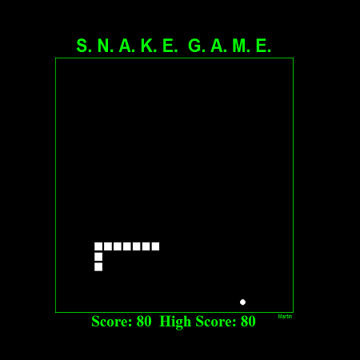

# Snake-Game
Game made in Python 2.7 using turtle graphics and elements of pygame.
Move the snake with arrow keys to collect circles.
The code of this game is begginer friendly.
To run the game you must run the file "snake_game.py".

